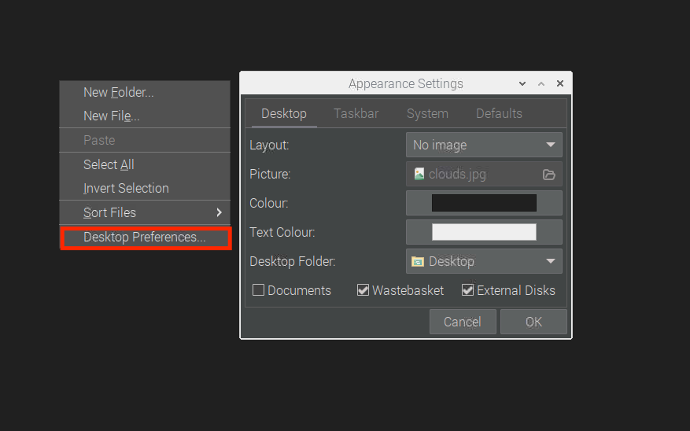

## Dotfiles for office raspies

### Requirements

- Raspberry Pi 3B (other versions not tested)
- 1Gb of free storage for swapfile allocation

### Raspi setup and installation

<b>Update all packages</b>

```sh
sudo apt update && sudo apt full-upgrade
```

<b>Install the Git cli and Stow</b>

```sh
sudo apt install git stow -y
```

<b>Clone this repo to the user (admin) root</b>

```sh
cd ~/ && git clone https://github.com/MelvinBrem/.raspi-dotfiles.git
```

<b>Change anything in the Desktop Preferences to create a necessary .conf files on the system</b>



<b>Run setup</b>

```sh
cd ~/.raspi-dotfiles/ && make && make setup
```
